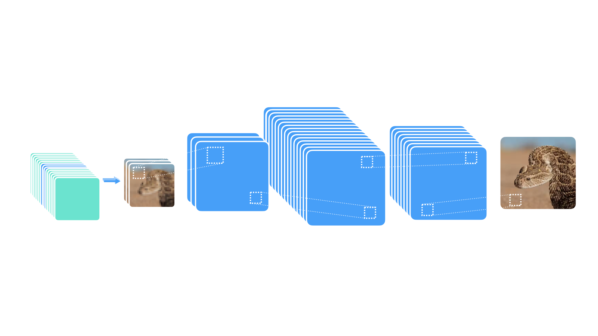
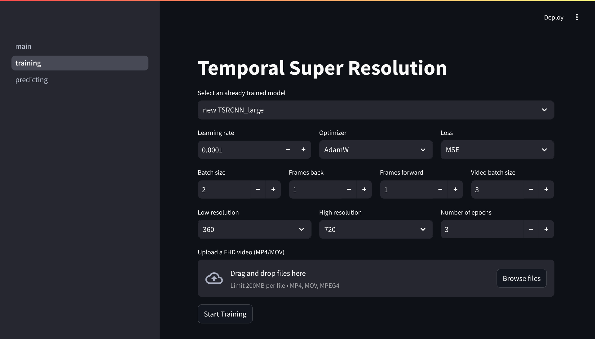
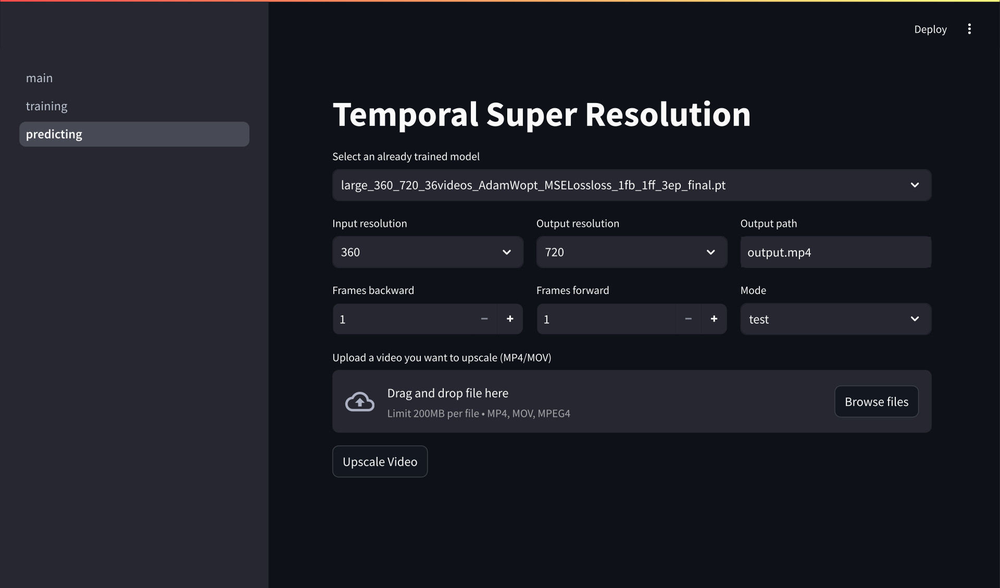

<link rel="stylesheet" href="./figures/styles.css">


<div align="center">

  
  <i>A Convolutional Neural Network for Video Upscaling and Enhancement</i>
</div>

<div align="center">
  
  <br>
  <em>The high-level architecture of our Temporal Super Resolution Model</em>
</div>

## <div align="center">Information</div>

<div align="center">
  <table>
    <tr>
      <td><strong>Author</strong></td>
      <td><b style="font-family: Arial, Helvetica, sans-serif; background: linear-gradient(to right, #f32170,rgb(255, 8, 230),rgb(15, 251, 231),rgb(0, 225, 255));-webkit-text-fill-color: transparent; -webkit-background-clip: text;">Dawid Siera</b>, <b style="font-family: Arial, Helvetica, sans-serif; background: linear-gradient(to right,rgb(0, 250, 17),rgb(1, 161, 25),rgb(1, 123, 5),rgb(0, 0, 0));-webkit-text-fill-color: transparent; -webkit-background-clip: text;">Anatol Kaczmarek<b></td>
    </tr>
    <tr>
      <td><strong>License</strong></td>
      <td>None</td>
    </tr>
    <tr>
      <td><strong>Frameworks</strong></td>
      <td>PyTorch, Streamlit</td>
    </tr>
  </table>
  
</div>

<br>

## <div align="center">Table of Contents</div>

<div align="center">

| Section                 | Path                                     |
| :---------------------: | :---------------------------------------: |
| **Model Architecture**  | [qsr/model.py](qsr/model.py)             |
| **Dataset Loading**     | [qsr/dataset_loading.py](qsr/dataset_loading.py) |
| **Training Process**    | [qsr/trainer.py](qsr/trainer.py)         |
| **Streamlit Pages**     | [pages/](pages)                          |
| **GUI Start Point**     | [main.py](main.py)                       |

</div>

<br>

## <div align="center">About the Project</div>

<div align="center">
  <p style="max-width:650px">
    This repository provides a user-friendly interface and backend to perform <strong>video super resolution</strong> using temporal convolutional neural networks. By leveraging the temporal dimension, we can enhance consecutive frames in a video to produce higher-resolution output, bridging the gap between a low-res input and crisp HD output.
  </p>
</div>

<br>

## <div align="center">Preview of the App</div>

<div align="center"><b>Training Model</b></div>
<br>



<div align="center"><b>Prediction with model</b></div>
<br>



<br>


## <div align="center">Using the Application</div>

1. **Install Dependencies**

Note: FFmpeg needs to be installed on the system.

```sh
pip install -r requirements.txt
```

2. **Start the Streamlit GUI along with MLFlow server**

```sh
sh run.sh
```

3. **Navigate to the Training Page**

    Choose `training page`, load your movie, specify hyperparameters and run the training! At this step you can adjust the learning rate, optimizer, and loss to experiment.

4. **Switch to Prediction**

    After training, move to the `Predicting page`. Select your trained model, upload a video, and generate a high-resolution version.

## <div align="center">Detailed Steps to Train</div>

1. **Data Preparation**  
   - Gather training videos in 360p resolution (or your chosen “low-res” setting).  
   - Ensure you have matching HD or 4K versions for ground truth.

2. **Hyperparameters**  
   - Tweak `Frames back/forward`, `Batch size`, `Number of epochs`, etc.  
   - Experiment with different `Optimizers` (`Adam`, `AdamW`, `SGD`) and `Loss` functions for best performance.

3. **Start Training**  
   - Once you click **Start Training** in the GUI, the system will begin iterating through epochs.  
   - Progress is logged in your console and within the Streamlit interface.

4. **Monitor Results**  
   - Watch for training loss and visual improvements in intermediate outputs.  
   - Adjust hyperparameters as necessary.

<br>

## <div align="center">Predictions (Testing Mode)</div>

1. **Select a Trained Model**  
   - Pick your best performer from the dropdown (e.g., `new_TSRCNN_large`).

2. **Set Input/Output Resolutions**  
   - Example: Input = 360p, Output = 720p.

3. **Frames Back/Forward**  
   - A setting of `1` means we use one frame behind and ahead to improve the current frame’s detail.

4. **Upload a Video**  
   - Drag & Drop your `.mp4` or `.mov` up to 200MB (customizable in `streamlit` config).

5. **Upscale Video**  
   - The app processes each frame (and its neighbors) and outputs a higher-resolution video.

<br>

## <div align="center">Under the Hood</div>

- **Model**: A temporal CNN leveraging neighboring frames to infer missing detail.  
- **Feature Extraction**: Uses convolutional layers to detect spatial features, combined with short-term memory across frames.  
- **Loss Functions**: PNSR, DSSIM (configurable) to reduce pixel-level errors.  
- **Framework**: PyTorch for the backend, Streamlit for easy UI.
